# PrismForge AI v4

**🔗 Live demo: [prismforgev4.net](http://prismforgev4.net)**

Good software is designed before it is written. PrismForge AI v4 was built on that premise: the architecture was locked down through a structured Socratic process — problem framing, schema specification, invariant definition, interface contract — before a single line of production code was committed. The code is the last artifact, not the first.

---

## What PrismForge AI Does

Corporate due diligence is a document reading problem disguised as a judgment problem. A deal team receives a data room — dozens of contracts, employment agreements, IP assignments, license disclosures — and must identify the risks that will survive closing. The reading is mechanical. The pattern-matching is mechanical. What requires human judgment is the synthesis: which contradictions matter, which liabilities are material, which gaps in coverage should block the deal.

PrismForge AI handles the mechanical layer. It takes a directory of documents as input. For each file, a Gemini Flash router determines what kinds of risk are present — `IP_Ownership`, `License_Compliance`, `Liability_Cap`, `Indemnification`, `Change_of_Control`, and others — producing a document-specific set of extraction lenses rather than applying a fixed template to every file. The document is then chunked and every chunk is analyzed under every assigned lens by a Claude Sonnet extraction worker, running concurrently across the full `Chunks × Lenses` matrix. Each worker returns a structured finding: entity, verbatim evidence quote, risk score 1–10, and any cross-document dependency links.

The terminal node is a Claude Sonnet synthesis call that receives all extraction records — sorted by risk score, capped at 500, with blind-spot coverage gaps identified explicitly — and produces a structured Markdown risk report with an executive summary, critical findings, cross-document contradictions, and recommendations. The report renders in a Streamlit interface with a download button. No vector store, no retrieval, no pre-built taxonomy. The extraction set is determined per document at runtime.

---

## Architecture

```mermaid
flowchart TD
    DR([Data Room Directory]):::entry

    subgraph CRAWLER["Directory Crawler"]
        DC[directory_crawler]:::proc
    end

    subgraph PDP["Per-Document Pipeline (parallel per file)"]
        direction TB
        RT["Router\n(Gemini Flash)"]:::llm
        CH["Chunker + Anchoring\nRecursiveCharacterTextSplitter\nchunk_size=4000  overlap=800"]:::proc
        MX["Matrix Fan-Out\nChunks × Lenses"]:::proc
        WP["Extraction Workers\n(Claude Sonnet)\nLangGraph Send pool"]:::llm
        HO["Handoff\nglobal_inbox + summary_store"]:::guard
    end

    PS[("ParentState\nglobal_inbox / summary_store")]:::state

    subgraph SL["Synthesis Layer"]
        direction TB
        BS{"detect_blind_spots()"}:::guard
        CI{"compress_inbox()\nlimit = 500 records"}:::guard
        MRT["Master Round-Table\n(Claude Sonnet)"]:::llm
    end

    subgraph OL["Output Layer"]
        FR["Final Risk Report\nMarkdown str"]:::output
        UI["Streamlit UI\nst.markdown + download"]:::output
    end

    DR -->|"data room path"| DC
    DC -->|"source_material per file"| RT
    RT -->|"semantic_summary + dynamic_topology"| CH
    CH --> MX
    MX -->|"WorkerPayload dict\n(chunk + lens + summary)"| WP
    WP -->|"ExtractionRecords"| HO
    HO -->|"summary_store + global_inbox"| PS
    PS --> BS
    BS --> CI
    CI --> MRT
    MRT -->|"Markdown report"| FR
    FR --> UI

    classDef llm fill:#FEF3C7,stroke:#D97706,color:#92400E,font-weight:bold
    classDef state fill:#FDF4FF,stroke:#A855F7,color:#6B21A8
    classDef entry fill:#DBEAFE,stroke:#2563EB,color:#1E3A8A,font-weight:bold
    classDef output fill:#D1FAE5,stroke:#059669,color:#065F46,font-weight:bold
    classDef guard fill:#EDE9FE,stroke:#7C3AED,color:#4C1D95
    classDef proc fill:#DBEAFE,stroke:#2563EB,color:#1E3A8A
```



_Legend: yellow = LLM call (Gemini Flash / Claude Sonnet), purple-tinted = ParentState channel, blue = entry point or processing step, green = output, lavender = guard / pure helper function._

---

## Why the Design Matters

**Dynamic Semantic Topology (DST).** A software license agreement and an employment contract do not have the same risk profile. Applying a fixed twelve-lens template to every document wastes LLM budget on irrelevant lenses and produces noise. DST means the router assigns 3–7 content-appropriate lenses per document at runtime. A document without a change-of-control clause is not analyzed under a `Change_of_Control` lens. The extraction set is never the same twice.

**Chunks x Lenses cross-product.** After routing, the document is split into ~1,000-token chunks (4,000 characters, 800-character overlap via `RecursiveCharacterTextSplitter`). Every chunk is analyzed under every assigned lens — independently and in parallel via LangGraph `Send`-dispatched worker nodes. This means a finding that spans a chunk boundary is caught by two overlapping chunks, and each lens is applied at the granularity of the chunk, not the whole document. A document with five chunks and five lenses produces twenty-five structured extraction records.

**Single-call router.** The router produces the semantic summary and the lens array in one structured LLM call — a single `RouterOutput` response from Gemini Flash via `.with_structured_output()`. There is no separate summary call followed by a separate lens selection call. One round-trip, both outputs atomically. The semantic summary is then stamped into every worker payload so each extraction worker has full-document context even when operating on a small chunk.

**No vector store.** There is no Chroma, no Pinecone, no embedding layer anywhere in the pipeline. Documents are chunked on raw text using a battle-tested splitter. Workers receive their chunk and their full-document summary in a single payload. Retrieval is not needed because the extraction is exhaustive across every chunk — there is nothing to retrieve because everything is already processed.

**Blind spot detection.** The Master Round-Table Node opens with `detect_blind_spots()`: a pure Python filter that compares the directory crawler's `crawled_files` list against the `source_file` fields of all collected extraction records. Any file that was read successfully but produced zero records is listed explicitly in the Coverage Gaps section of the report. A silent omission is worse than a named gap. The analyst knows what was not analyzed.

---

## How It Was Built

This project began with domain learning, not code. The approach was:

1. **Domain learning.** Understand what corporate due diligence actually involves before designing anything that touches it. What is a data room? What do reviewers look for? What makes a finding actionable?

2. **Socratic design.** Claude was used as a design partner: the architecture was challenged question by question. Why does the summary need to travel inside the worker payload? Why is a pre-fan-out handoff wrong? What happens to `summary_store` without a merge reducer? Each answer forced the design to be more precise or exposed an error.

3. **Interface contract before implementation.** `INTERFACE_CONTRACT.md` was finalized before any node was coded. Every function signature, every state field and its reducer, every invariant — all locked down in a binding contract. Code that violates the contract is a build failure by definition.

4. **Masterplan and subplans.** The implementation was decomposed into four subplans, each with an explicit verification checklist. No phase advanced until the prior phase's checklist passed.

5. **Implementation.** With the contract and plans in place, implementation was a translation exercise. The hard decisions had already been made.

6. **Feedback loop.** After initial implementation, every structural deviation from the original spec was documented explicitly in `DESIGN.md` decisions 3.17–3.22 and reconciled against the interface contract. A second pass rewrote `pipeline.py` to the spec-compliant sub-graph architecture. The design documents track both the original deviations (as decision history) and the current state.

7. **Post-deployment improvements.** After deployment, several targeted improvements were made: an animated 6-stage pipeline diagram with live stage activation (CRAWL → ROUTE → CHUNK → EXTRACT → SYNTHESIZE → REPORT), a dynamic lens selection topology widget showing per-document colored chips as routing completes, a live worker counter ("Workers: 23/50 complete | 2 retrying..."), document preview expanders in the config panel, extraction worker retry backoff for Anthropic Tier 1 rate limits (Decision 3.24), and replacement of synthetic fixture files with real EDGAR documents (HP/Dot Hill). All changes were reconciled against the design documents incrementally.

All architectural judgment belongs to the developer. Claude provided Socratic pressure — it asked the questions that forced the design to be more precise — but it did not make decisions. The invariants, the schema choices, the decision to eliminate sub-graphs, the choice of a flat monolithic `pipeline.py` over a `src/` module tree: these are all deliberate human decisions with documented rationale.

The code is intentionally disposable. `pipeline.py` is a monolith by design: in a 10-hour sprint, module decomposition has a negative return. When test coverage warrants it, the decomposition into `src/schemas.py`, `src/nodes.py`, `src/graph.py`, and `src/prompts.py` is straightforward — `app.py` imports only `run_graph`, so the split does not cross file boundaries. The design documents outlast any particular implementation structure.

---

## Companion Documents

| Document | Description |
|---|---|
| [`docs/DESIGN.md`](docs/DESIGN.md) | Consolidated decision ledger — every architectural decision in Problem / Selected / Rejected / Rationale format, including post-implementation deviations (decisions 3.17–3.22) |
| [`docs/INTERFACE_CONTRACT.md`](docs/INTERFACE_CONTRACT.md) | Binding contract — every function signature, state schema, reducer, and invariant across module boundaries; the authoritative spec that code must satisfy |
| [`docs/GLOSSARY.md`](docs/GLOSSARY.md) | Term definitions for two audiences: Part 1 for nontechnical readers, Parts 2–3 for developers returning to the codebase |
| [`docs/setup_notes.md`](docs/setup_notes.md) | Deployment reference — environment setup, API key configuration, Docker commands, and all known runtime issues with workarounds |
| [`walkthrough/README.md`](walkthrough/README.md) | Architecture walkthrough — file-flow diagram, high-level data flow, key decision summary, and invariant quick reference |
| [`prompts/README.md`](prompts/README.md) | Index of the BATCH prompts that produced the design artifacts and this README — evidence that the thinking preceded the code |

---

## Tech Stack

| Layer | Technology |
|---|---|
| Orchestration | LangGraph |
| Schema validation | Pydantic v2 |
| LLM integration | LangChain, langchain-anthropic, langchain-google-genai |
| Text splitting | langchain-text-splitters |
| Concurrency | asyncio, concurrent.futures.ThreadPoolExecutor |
| Extraction LLM | Anthropic Claude Sonnet (claude-sonnet-4-20250514) |
| Routing LLM | Google Gemini Flash (gemini-2.5-flash) |
| HTML preprocessing | BeautifulSoup4 |
| UI | Streamlit |
| Deployment | Docker, AWS EC2 |

---

## Setup and Demo

A live instance is deployed at **[prismforgev4.net](http://prismforgev4.net)**. To run your own instance, follow the steps below.

### Prerequisites

- Docker (recommended) or Python 3.11
- An Anthropic API key with access to `claude-sonnet-4-20250514`
- A Google AI API key with access to `gemini-2.5-flash` — a paid Google Cloud billing account is required; free-tier quota is exhausted in one run on a 3-file data room

### Clone and build

```bash
git clone https://github.com/rlin25/PrismForgeAI.git
cd PrismForgeAI
docker build -t prismforge-ai:latest .
```

### Run (Docker)

```bash
docker run \
  -e ANTHROPIC_API_KEY=$ANTHROPIC_API_KEY \
  -e GOOGLE_API_KEY=$GOOGLE_API_KEY \
  -p 80:8501 \
  prismforge-ai:latest
```

Open `http://localhost` in your browser (port 80 mapped to Streamlit's 8501 inside the container).

For EC2 deployment, replace `localhost` with your instance's public IP. Port 80 must be open in the security group.

### Run (local, no Docker)

```bash
pip install -r requirements.txt
pip install "aiohttp>=3.13.5"   # temporary fix — not yet pinned in requirements.txt
export ANTHROPIC_API_KEY=your_key
export GOOGLE_API_KEY=your_key
python3 preprocess.py           # convert source_docs/*.htm → data_room/*.txt
streamlit run app.py
```

### Demo flow

1. Convert the raw EDGAR source filings to clean plain-text: `python3 preprocess.py`. This reads `.htm` files from `source_docs/` and writes preprocessed `.txt` files to `data_room/`. The data room contains real EDGAR documents: the HP/Dot Hill Product Purchase Agreement (EX-10.1) and the Dot Hill FY2006 10-K.
2. Open the Streamlit UI. Enter the absolute path to your data room directory (default: `./data_room`). Expand the document preview expanders in the config panel to inspect the first 1,500 characters of each file before running.
3. Click Run. The animated 6-stage pipeline diagram activates: stages (CRAWL → ROUTE → CHUNK → EXTRACT → SYNTHESIZE → REPORT) turn green as each completes. As routing finishes, colored lens chips appear per document in the topology widget, showing which extraction lenses were assigned to each file (the Dynamic Semantic Topology feature made visible). A live worker counter updates the extraction progress ("Workers: N/M complete | K retrying...").
4. The risk report renders as Markdown below the pipeline diagram only after generation completes. Use the download button to save it.
5. Check the Coverage Gaps section. Any file that was read but produced no extraction records will be listed there explicitly.

### API key notes

If your shell uses an interactive-shell guard in `~/.bashrc` (as EC2 and WSL2 instances often do), keys exported there will not be visible to non-interactive child processes. Store keys in `~/.profile` instead and run `source ~/.profile` before building the container.

---

## Known Issues

1. `aiohttp 3.9.5` (default in Python 3.11-slim) is missing `ClientConnectorDNSError` — run `pip install "aiohttp>=3.13.5"` after installing `requirements.txt`. The permanent fix is to pin this version in `requirements.txt`.
2. `gemini-2.0-flash` is deprecated for new Google AI API accounts. `pipeline.py` uses `gemini-2.5-flash`.
3. Google AI free-tier quota is exhausted almost immediately. Paid billing must be enabled.
