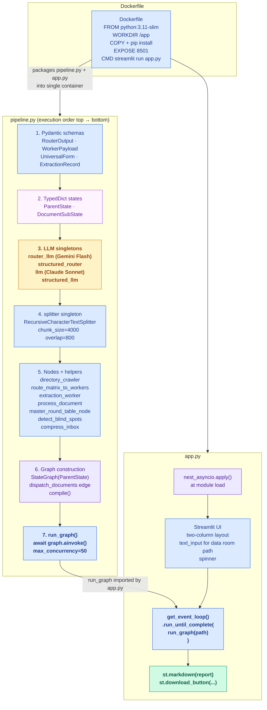

# PrismForge AI v4 — Walkthrough Index

This directory documents the architecture and rationale of PrismForge AI v4, a multi-agent
LangGraph pipeline for corporate due diligence risk analysis. These files explain WHY the
code is written as it is — not what each line does.

All application logic lives in a single monolithic `pipeline.py`. There is no `src/`
subdirectory. See Decision 3.17 for the rationale.

---

## File Flow Diagram



_Legend: yellow = LLM singleton, purple-tinted = state schema, blue = processing step or invocation entry point, green = rendered output, lavender = guard / graph wiring. Numbered annotations show the logical top-to-bottom execution order within `pipeline.py` at module load time._

---

## File Index

| File | What it covers |
|---|---|
| [pipeline.md](pipeline.md) | The monolithic `pipeline.py` — all schemas, singletons, nodes, helpers, and graph construction |
| [app.md](app.md) | `app.py` — the Streamlit frontend and async bridge |
| [dockerfile.md](dockerfile.md) | `Dockerfile` — container build, deployment, and API key injection |

---

## High-Level Data Flow

```
[app.py]
  nest_asyncio.apply()                  -- patches Streamlit's running event loop
  get_event_loop().run_until_complete(run_graph(path))
          |
          v
[pipeline.py — LangGraph graph]

  START
    |
    v
  directory_crawler                     -- reads all UTF-8 files; populates crawled_files
    |
    | dispatch_documents (conditional edge)
    | emits one Send("process_document", {source_material, file_name}) per file
    |
    v  (up to 50 concurrent, per max_concurrency)
  process_document  [x N files]
    |  1. structured_router.ainvoke → RouterOutput
    |     (semantic_summary + dynamic_topology in one call)
    |  2. splitter.split_text → document_chunks
    |  3. route_matrix_to_workers → List[payload_dict]  (chunks × lenses)
    |  4. asyncio.gather(extraction_worker per payload)
    |  5. return {"global_inbox": [...], "summary_store": {file: summary}}
    |
    | (ParentState reducers accumulate across all N process_document calls:
    |   global_inbox via operator.add
    |   summary_store via lambda a, b: {**a, **b})
    |
    v
  master_round_table_node
    |  1. detect_blind_spots(crawled_files, global_inbox)
    |  2. compress_inbox(global_inbox, limit=500)
    |  3. llm.ainvoke → free-form Markdown report
    |
    v
  END → master_risk_report (str)
          |
          v
[app.py]
  st.markdown(report)
  st.download_button(...)
```

---

## Key Architectural Decisions (Summary)

| Decision | What was chosen | Why |
|---|---|---|
| 3.17 | Monolithic `pipeline.py` | Sprint overhead of module decomposition exceeds benefit with no test harness |
| 3.18 | Flat graph, `process_document` as single async node | Sub-graph state propagation for `global_inbox`/`summary_store` risks silent data loss |
| 3.19 | `asyncio.gather` for worker pool | Zero per-call graph overhead vs LangGraph Send; same invariants satisfied |
| 3.16 | `detect_blind_spots` as Python function | A list filter is simpler and more transparent than a conditional graph node |
| 3.10 | `compress_inbox` 500-record guard | Keeps synthesis prompt within frontier model context limits |
| 3.4 | `max_concurrency=50` at graph invocation | Single unified throttle; no module-level Semaphore |
| 3.11 | Streamlit + `nest_asyncio` | Stays in pure Python; eliminates JavaScript/SSE layer |
| 3.12 | Single Docker container on EC2 | Environmental determinism; managed PaaS fails with heavy AI dependency stacks |

---

## Invariant Quick Reference

The following invariants are referenced throughout these walkthrough files. For the full
binding contract see `docs/INTERFACE_CONTRACT.md`.

| ID | Rule |
|---|---|
| S1 | All four LLM singletons at module scope — never inside a node or worker |
| S2 | No module-level `asyncio.Semaphore` |
| S3 | No vector store imported or instantiated anywhere |
| P1 | `summary_store` uses merge reducer `lambda a, b: {**a, **b}` |
| P2 | `crawled_files` has no reducer — single write by crawler |
| R1 | Exactly one `structured_router.ainvoke` call per document |
| E3 | `route_matrix_to_workers` emits primitive dicts via `.model_dump()`, never Pydantic instances |
| E4 | `semantic_summary` stamped into every `WorkerPayload` at dispatch time |
| X1 | `extraction_worker` takes exactly one parameter (`payload_dict`) — no state parameter |
| X2 | `extraction_worker` reads `semantic_summary` from payload, never from state |
| X3 | `extraction_worker` uses `await structured_llm.ainvoke(...)` — never sync `.invoke()` |
| X4 | `extraction_worker` entire body wrapped in `try/except` — returns `{"local_inbox": []}` on failure |
| X5 | `extraction_worker` returns a constructed `ExtractionRecord`, not a raw dict |
| H1 | Exactly one handoff per document, firing after all workers complete |
| H2 | Handoff writes both `summary_store` and `global_inbox` in a single return dict |
| M1 | Single-shot synthesis — no map-reduce |
| M2 | Synthesis receives compressed records, never raw `global_inbox` |
| M3 | Blind-spot detection is a Python filter, not a graph node |
| C1 | `chunk_size=4000` is characters, not tokens |
| I1 | `max_concurrency=50` set only at graph invocation |
| I2 | Never `asyncio.run()` inside Streamlit — use `nest_asyncio` + `run_until_complete` |
| W1 | `WorkerPayload` fields are JSON-primitive only |
| W2 | `semantic_summary` is a required `WorkerPayload` field |

---

## v5 Touch Points (Cross-File)

These are the areas most likely to change in v5, independent of any single file:

- **Streaming output to Streamlit:** `master_round_table_node` currently collects the full
  report before `app.py` renders it. v5 would use `graph.astream` and update the Streamlit
  component incrementally, requiring a refactor of both `app.py` and the synthesis node.
- **`requirements.txt` pin for `aiohttp`:** `aiohttp>=3.13.5` must be pinned. The current
  `requirements.txt` omits this, requiring a runtime `pip install` after container start.
- **Module decomposition:** When test coverage warrants it, `pipeline.py` should split into
  `src/schemas.py`, `src/nodes.py`, `src/graph.py`, and `src/prompts.py`. `app.py` imports
  only `run_graph` so the split would not change the `app.py`/`pipeline.py` boundary.
- **Sub-graph migration:** If LangGraph's sub-graph state propagation API stabilizes, the
  flat `process_document` node is the natural candidate to become a true sub-graph. All
  invariants are already satisfied at the behavioral level; only the structural wiring needs
  to change.
